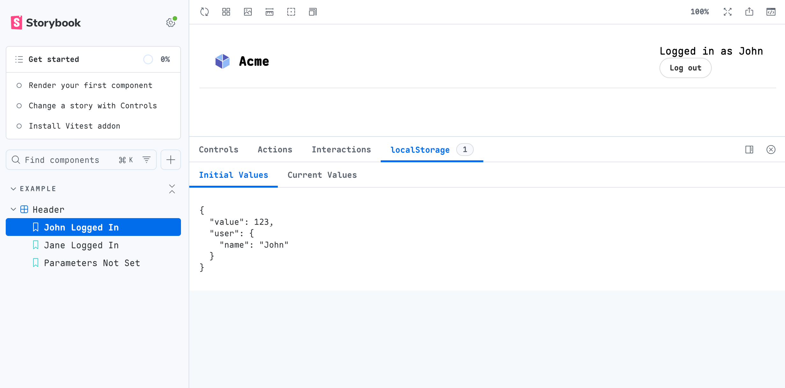

# Storybook LocalStorage Addon

A [Storybook](https://storybook.js.org/) Addon and Decorator for [`window.localStorage`](https://developer.mozilla.org/en-US/docs/Web/API/Window/localStorage) and track the state in a Panel.

If you want to setup `parameters` to be strongly typed, see [@alexgorbatchev/storybook-parameters](https://github.com/alexgorbatchev/storybook-parameters).



## Install

```sh
yarn add -D @alexgorbatchev/storybook-addon-localstorage
```

Register the addon in `.storybook/main.js`

```ts
module.exports = {
  stories: ['../stories/**/*.stories.tsx'],
  addons: ['@alexgorbatchev/storybook-addon-localstorage'],
};
```

## Usage

Given a simple component:

```tsx
export const Header = () => {
  const [user, setUser, { removeItem }] = useLocalStorage<{ name: string }>('user');

  return (
    <div>
      {user ? (
        <div>
          <div>{`Logged in as ${user.name}`}</div>
          <Button size="small" label="Log out" onClick={() => removeItem()} />
        </div>
      ) : (
        <div>
          <div>No one is signed in</div>
          <Button size="small" label="Log in" onClick={() => setUser({ name: 'John' })}/>
        </div>
      )}
    </div>
  );
};
```

You can write a story as

```tsx
import { withLocalStorage, localStorageForStorybook } from '@alexgorbatchev/storybook-addon-localstorage';
import { ComponentMeta, ComponentStoryObj } from '@storybook/react';

import { Header } from './Header';

type Story = ComponentStoryObj<typeof Header>;

const meta: ComponentMeta<typeof Header> = {
  title: 'Header',
  component: Header,
  decorators: [withLocalStorage],
};

export default meta;

export const JohnLoggedIn: Story = {
  parameters: {
    // this helper automatically stringifies the values using `JSON.stringify`
    localStorage: localStorageForStorybook({
      value: 123,
      user: { name: 'John' },
    }),
  },
};

export const JaneLoggedIn: Story = {
  parameters: {
    // if you have own serialzer, you can use it as well
    localStorage: {
      value: '123',
      user: JSON.stringify({ name: 'Jane' }),
    },
  },
};

export const LoggedOut: Story = {};

```

Strongly typed example:

```tsx
import { ComponentMeta, ComponentStoryObj } from '@alexgorbatchev/storybook-parameters';
import { LocalStorageParameters, withLocalStorage } from '@alexgorbatchev/storybook-addon-localstorage';

interface StoryParameters extends LocalStorageParameters {}

const Header = () => <div>Header</div>;

type Story = ComponentStoryObj<typeof Header, StoryParameters>;

const meta: ComponentMeta<typeof Header, StoryParameters> = {
  title: 'Header',
  component: Header,
  decorators: [withLocalStorage],
};

export default meta;

export const JohnLoggedIn: Story = {
  parameters: {
    // `localStorage` is strongly typed
    localStorage: {
      key: 'value',
    }
  },
};
```

### Development scripts

- `yarn start` runs babel in watch mode and starts Storybook
- `yarn build` build and package your addon code
